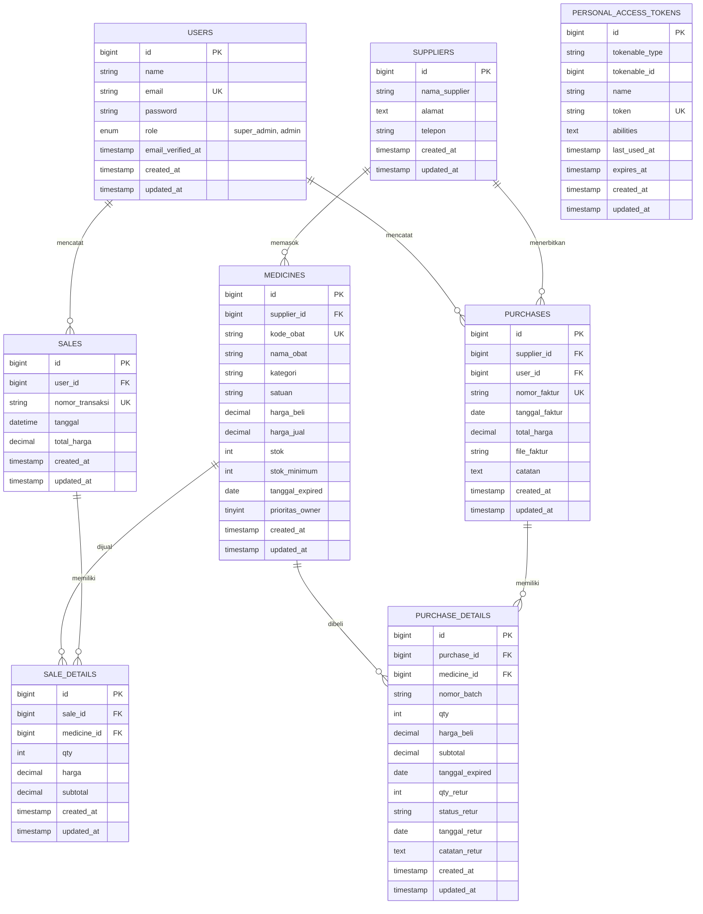

# ERD POS Apotek

## Relasi

- `users` mencatat banyak `sales`.
- `users` mencatat banyak `purchases`.
- `suppliers` memasok banyak `medicines`.
- `suppliers` menerbitkan banyak `purchases`.
- `sales` memiliki banyak `sale_details`.
- `medicines` dapat muncul di banyak `sale_details`.
- `purchases` memiliki banyak `purchase_details`.
- `medicines` dapat muncul di banyak `purchase_details`.
- `purchase_details` menyimpan nomor batch, tanggal expired, dan status retur berdasarkan faktur pembelian.
- Token autentikasi disimpan oleh Laravel Sanctum pada `personal_access_tokens`.

## Kriteria SAW

| Kode | Kriteria | Tipe | Bobot |
|---|---|---:|---:|
| C1 | Jumlah Penjualan Obat | Benefit | 30% |
| C2 | Stok | Cost | 25% |
| C3 | Risiko Masa Kedaluwarsa | Cost | 20% |
| C4 | Tingkat Prioritas Owner (1-5) | Benefit | 15% |
| C5 | Harga Obat | Benefit | 10% |

C3 direpresentasikan sebagai risiko kedaluwarsa agar obat yang makin dekat masa kedaluwarsa mendapat penalti prioritas restock.
